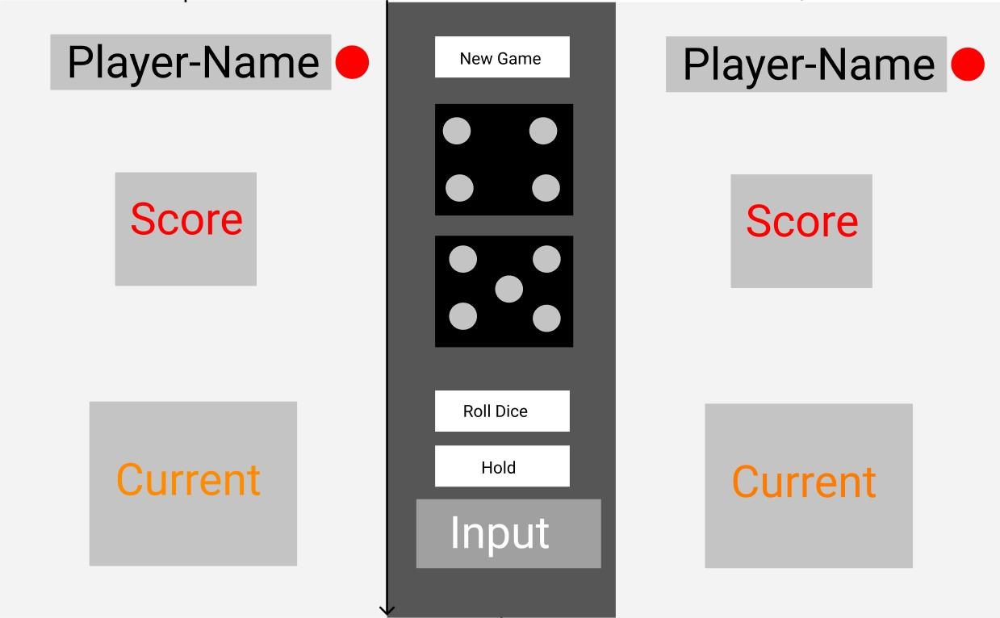
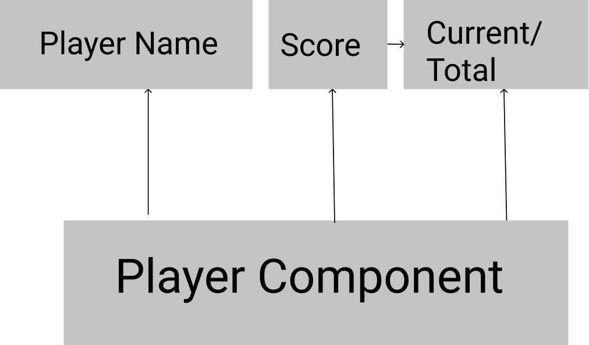
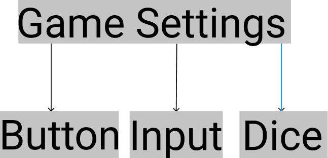
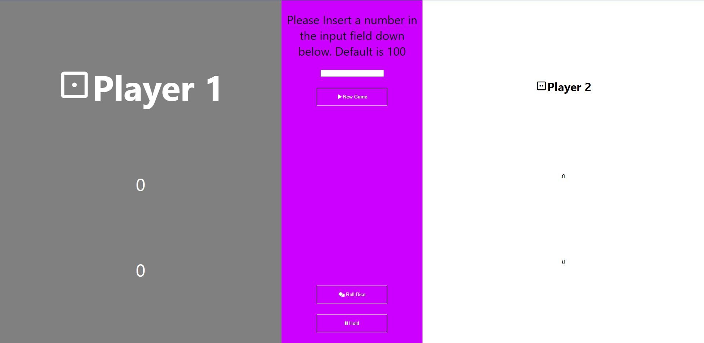
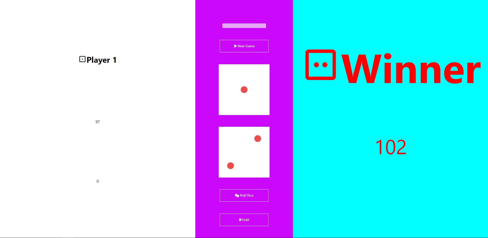

# Dice Game Project
### This is my first ever React Project i do. a Dice game project
## How to play : 
1. You can enter a number inside the input field or leave it empty, if you leave it Empty it'll be set to default score which is 100
2. Click on Roll Dice Button and start rolling the dice. after first Roll the input field will be locked and you cannot change the points to win score.
3. If you reach any kind of doubles you'll lose your current score and pass your turn to the second player
4. Press on the HOLD button to add your current score to your total and pass over the turn to the other player

# Project wireframe
## I used Figma to draw the project at first and thats what i got

# Project Build
## This is how the game looks like :

## When you win a game :

# Project Funcions
# I used multiple functions to build the logic of this game
1. Roll Dice Function
2. Hold / Pass Turn Function
3. New Game Function

## What does each function do?
### Roll Dice : Picks a random number between 1 to 6, and then display in the gameSettings container two images of the dice according to the selected number
### Hold Function : Adds the the currentScore to the totalplayer score and then passes the turn to the other player
### New Game : Easiest function you can come across.. just re set the state to its default

## Project link

[Dice-Game-Project](https://rougenij-dicegame.netlify.app/)
